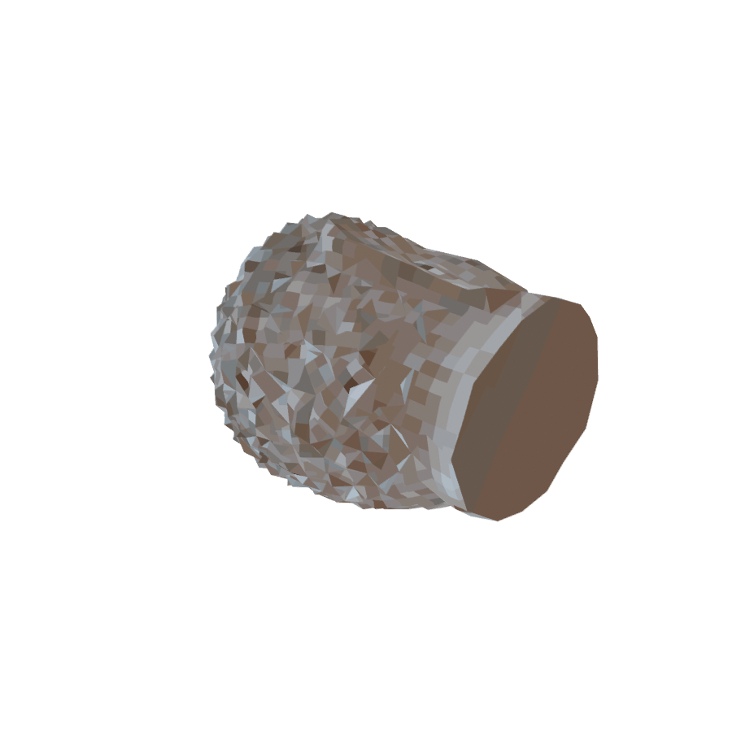

# Lo-Fi Converter — Blender Add-on

Convert a **reconstructed / scanned 3D mesh** into a **lo-fi, low-poly, pixelated,
unlit game asset** in the PS1/retro aesthetic, exported as glTF `.glb`.

It does **not** do reconstruction. It consumes a mesh — however it was made — and
does the one thing reconstruction tools don't: the lo-fi transform (decimate →
re-UV → bake → palettize → unlit + nearest-filter material → export).

Developed and verified against **Blender 5.1.2** (targets 4.2 LTS+).



## What you get

The exported `.glb` carries:
1. **Low-poly geometry** (default ≈ 1500 triangles, watertight).
2. **A small palettized texture** (default 128 px, 32 colours).
3. **Material flags**: unlit (`KHR_materials_unlit`) + **nearest** filtering
   (`magFilter = 9728`, no smoothing) — the PS1 look.

Vertex jitter, affine warping, dithering and low-res rendering are the *game
engine's* shaders, not baked here.

## Inputs

A Blender **mesh object** carrying colour as either:
- a **material with an Image Texture** (e.g. Apple Object Capture `OBJ`/`USDZ`,
  or the sibling `../3d_model_generator` pipeline's `.glb`), or
- **vertex colours** (a Color Attribute — common for scan meshes).

Multi-material meshes are handled (each slot is baked, nothing dropped). A mesh
with no colour bakes a neutral fill rather than crashing. A raw point cloud
(0 faces) is out of scope — mesh it first (Object Capture and the sibling's
OpenMVS both output meshes; or use Blender's remesh).

## Install

### As a legacy add-on (simplest for development)

```bash
# Blender 5.1 user dir ships only extensions/, so create the legacy dir:
mkdir -p "$HOME/Library/Application Support/Blender/5.1/scripts/addons"
ln -s "$PWD" "$HOME/Library/Application Support/Blender/5.1/scripts/addons/lo_fi_converter_blender_addon"
```

Then in Blender: *Edit > Preferences > Add-ons*, search "Lo-Fi", enable it.

### As an extension (4.2+ distribution)

The repo ships a `blender_manifest.toml`. Build/validate with:

```bash
/Applications/Blender.app/Contents/MacOS/Blender --command extension validate .
/Applications/Blender.app/Contents/MacOS/Blender --command extension build --source-dir .
```

Install the resulting `.zip` via *Preferences > Get Extensions > Install from Disk*.

## Usage — UI

1. Select a mesh object.
2. Open the **3D Viewport sidebar** (press `N`) → **Lo-Fi** tab.
3. Pick a **Preset** (PS1 / Lo-Fi / N64 / Hi-Fi) or set budgets manually; toggle
   any pipeline steps; set the **Output .glb** path.
4. Click **Convert to Lo-Fi**.

The add-on works on a **duplicate** — your original scan is never modified. On
any failure the partial copy is deleted and the scene state restored, so your
`.blend` is never left dirty.

## Usage — headless / batch

```bash
/Applications/Blender.app/Contents/MacOS/Blender --background \
  --python scripts/run_headless.py -- IN.glb OUT.glb \
  --tris 1500 --tex 128 --colors 32 \
  --render-geo geo.png --render-tex tex.png
```

Supports `.glb/.gltf/.obj/.ply/.usdz/.fbx/.stl` input. Flags:
`--tris --tex --colors --size`, `--no-heal --no-watertight --no-decimate
--no-normalize --no-pixelate --no-gpu`, `--render-geo PNG --render-tex PNG`.

## The pipeline (on a copy of the active object)

`prep → heal → watertight → decimate → normalize → re-UV → bake → pixelate →
material → export`, each a toggle.

| Step | What it does |
|------|--------------|
| **prep** | apply transforms; merge doubles; delete loose/zero-area geo; detect colour source |
| **heal** | keep the largest connected component (drops floating scraps) |
| **watertight** | `fill_holes` caps open boundaries (e.g. the unseen underside); cap UVs flattened so it bakes a flat colour |
| **decimate** | triangulate, then collapse to the triangle budget (±15% band, capped iterations) |
| **normalize** | centre on world origin; scale longest edge to the target size |
| **re-UV** | new UV map via Smart UV Project |
| **bake** | Cycles **EMIT** bake of the colour source onto the new UVs (Metal GPU / CPU) |
| **pixelate** | numpy median-cut to an N-colour palette |
| **material** | Image (`Closest`) → Material Output → unlit + nearest |
| **export** | `.glb` (GLB, embedded PNG) + `glb_verify` assertions |

## Capture tips

- **Apple Object Capture** (macOS / Apple Silicon, no NVIDIA needed) → textured
  `OBJ`/`USDZ` with clean UVs. The leanest native Mac path.
- **The sibling `../3d_model_generator`** (COLMAP + CPU-OpenMVS, containerized,
  cross-platform) → a textured `.glb`. Import its `.glb` (not the raw OpenMVS
  `.ply`, whose per-face UVs Blender drops).
- Photograph the **underside** too if you want a real textured bottom; otherwise
  the watertight cap is a flat colour (fine for a base on the ground).

## Verification

The cardinal rule: *look at it*. Every conversion can render a 3/4 view
(`--render-geo` / `--render-tex`) AND runs `utils/glb_verify.py`, which parses the
`.glb` and asserts `KHR_materials_unlit`, `magFilter == 9728`, texture dimensions
and triangle count. The unlit flag is **only** verifiable from the glTF JSON — no
render shows it — so that check is a hard gate.

Run the quantizer unit tests (numpy only, no Blender):

```bash
/Applications/Blender.app/Contents/Resources/5.1/python/bin/python3.13 tests/test_quantize.py
```

## Layout

```
__init__.py        bl_info + register/unregister
properties.py      LoFiSettings (budgets, presets, toggles, output path)
pipeline/          pure functions on bpy objects (prep, heal, watertight,
                   decimate, normalize, uv, bake, pixelate, material, export,
                   convert)  — callable from the operator AND headless
utils/             bake_device, scene_state, glb_verify, render_check
operators/         LOFI_OT_convert (thin wrapper over pipeline.convert)
ui/                LOFI_PT_panel ("Lo-Fi" N-panel tab)
scripts/           run_headless.py; rebake.py (vendored reference)
tests/             test_quantize.py
```
